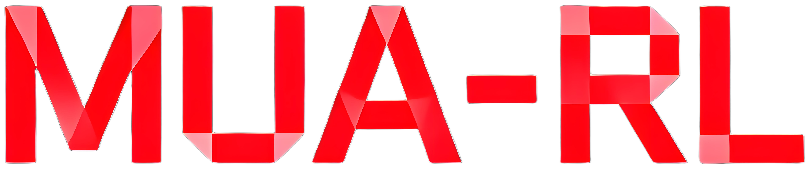
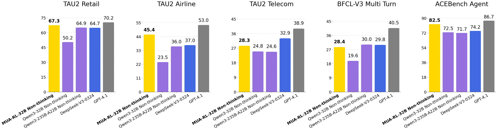

<div align="center">
  <picture>
      
  </picture>
</div>

<hr>

<div align="center" style="line-height: 1;">

[](https://huggingface.co/zzwkk/MUA-RL-32B)
[](https://huggingface.co/datasets/zzwkk/MUA-RL-Dataset)
[](https://arxiv.org/abs/2508.18669)
[](https://github.com/zzwkk/MUA-RL)


</div>

# Introduction

We present **MUA-RL**(MULTI-TURN USER-INTERACTING AGENT REINFORCEMENT LEARNING FOR AGENTIC TOOL USE), a reinforcement learning framework for training large language models with multi-turn conversation capabilities and agentic tool usage. MUA-RL is specifically designed for **multi-turn user interaction scenarios** where agents need to maintain context across conversations while effectively utilizing tools to complete complex tasks.

<p align="center">
  
</p>

## ✨ Features

- 🔄 **Multi-turn Conversation Support**: Maintain context across multiple conversation turns for complex task completion
- 🛠️ **Agentic Tool Usage**: Seamless integration with various tools and APIs for real-world applications
- 📊 **Flexible Environment Management**: Dynamic environment creation for each rollout to ensure fresh context
- 🔧 **Easy Checkpoint Conversion**: Automatic conversion from distributed checkpoints to Hugging Face format

## 🚀 Quick Start

### 1. Installation

#### Prerequisites
- Python 3.8+
- CUDA 11.8+ (for GPU training)
- PyTorch 2.0+

#### Quick Install

```bash
# Clone the repository
git clone https://github.com/zzwkk/MUA-RL.git
cd MUA-RL

# Install dependencies
pip install -e .
pip install -r requirements_sglang.txt
pip install transformers==4.51.1
```

### 2. Configure Training

Edit the training script parameters:

```bash
# Edit model path and other parameters in the script
vim examples/sglang_multiturn/mua_32b.sh
```

#### Key Parameters to Modify:

| Parameter | Description | Example |
|-----------|-------------|---------|
| `MODEL_PATH` | Path to your base model | `/path/to/your/model` |
| `N_NODE` | Number of nodes for distributed training | `4` |
| `BATCH_SIZE` | Training batch size | `32` |
| `EPOCH_NUM` | Number of training epochs | `30` |
| `API_KEY` | OpenAI API key for evaluation model | `sk-...` |
| `BASE_URL` | OpenAI API base URL | `https://api.openai.com/v1` |
| `CKPT_DIR` | Directory path to save model checkpoints | `/path/to/checkpoints` |
| `TENSORBOARD_DIR` | Directory path for TensorBoard logs | `/path/to/tensorboard` |
| `ROLLOUT_LOG_PATH` | Directory path for rollout generation logs | `/path/to/rollout_logs` |
| `VALID_LOG_PATH` | Directory path for validation logs | `/path/to/validation_logs` |

### 3. Run Training

#### Multi-Node Training (4 * 8 GPUs)

```bash
# For 4*8 GPU setup, suggest H200 141GB
bash examples/sglang_multiturn/mua_32b.sh
```


### 4. Convert Checkpoints to Hugging Face Format

After training, convert distributed checkpoints to Hugging Face format:

```bash
# Edit the merge script configuration
vim scripts/merge.sh

# Set your model path and name
BASE_DIR="/path/to/your/checkpoints/"
MODEL_NAME="your_model_name"

# Run the conversion
bash scripts/merge.sh
```

The script will automatically:
- 🔍 Find all `global_step_*` directories
- 🔄 Convert FSDP/Megatron checkpoints to Hugging Face format
- 💾 Save merged models to `iter_XXXXXX/actor/unify_checkpoint/`

## 📁 Project Structure

### Core Files

| File/Directory | Description |
|----------------|-------------|
| `examples/sglang_multiturn/mua_grpo.sh` | Main training script for GRPO |
| `scripts/merge.sh` | Checkpoint conversion script |
| `scripts/model_merger.py` | Model format conversion utilities |
| `verl/workers/rollout/sglang_rollout/` | Core rollout implementation |
| `verl/workers/rollout/schemas.py` | Conversation management and backpropagation control |
| `MUA_environments/` | Environment management system |


## 🏗️ Architecture

MUA-RL follows a modular architecture designed for scalability and flexibility:

- **Environment Manager**: Creates fresh environments for each rollout
- **Tool Registry**: Manages available tools and their configurations
- **Data Loader**: Handles data loading and preprocessing
- **Rollout Worker**: Executes multi-turn conversations with tool usage

## 📞 Contact

For questions and support, please open an issue or contact us at [GitHub Issues](https://github.com/zzwkk/MUA-RL/issues).

<!-- [](https://www.star-history.com/#zzwkk/MUA-RL&Date) -->


## 🙏 Acknowledgments

- Thanks to the open-source community for the excellent tools and libraries
- Special thanks to all contributors who help improve MUA-RL

## 📄 License

This project is licensed under the Apache License 2.0 - see the [LICENSE](LICENSE) file for details.

## Citation

If you use MUA-RL in your research, please cite our paper:

```bibtex
@misc{zhao2025mua,
  title={MUA-RL: Multi-turn User-interacting Agent Reinforcement Learning for Agentic Tool Use},
  author={Weikang Zhao and Xili Wang and Chengdi Ma and Lingbin Kong and Zhaohua Yang and Mingxiang Tuo and Xiaowei Shi and Yitao Zhai and Xunliang Cai},
  year={2025},
  eprint={2508.18669},
  archivePrefix={arXiv},
  primaryClass={cs.AI},
  url={https://arxiv.org/abs/2508.18669}
}
```


